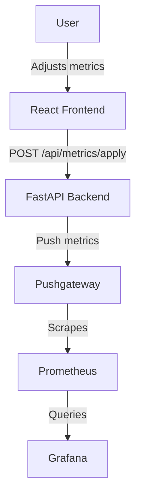

# Birdseye

A Prometheus metrics simulator with React frontend, FastAPI backend, and complete monitoring stack.

## Architecture



**Stack**: React + Tailwind • FastAPI + SlowAPI • Prometheus + Pushgateway + Grafana • Kubernetes + Helm • Traefik

## Quick Start

### Development (Hot-reload)
```bash
chmod +x develop.sh && ./develop.sh
```

### Local K3s Deployment
```bash
chmod +x deploy.sh && ./deploy.sh
```

## Security Features

- **Rate Limiting**: 3 requests/15min for changes, 300/min general
- **Input Validation**: Pydantic models, 1MB max request size
- **CORS**: Explicit origin allowlist in production
- **Headers**: Security headers (nosniff, DENY, XSS protection)
- **SSL/TLS**: Let's Encrypt certificates via cert-manager
- **Container**: Non-root, resource limits, private registry

## Production Deployment

### Prerequisites
- Kubernetes cluster with Traefik ingress
- Helm 3.x
- Azure Pipelines with self-hosted agent
- K3s kubeconfig (`k3s.yml` in Azure DevOps secure files)

### Required Variables (k3s-deployment-vars group)
```
GHCR_USERNAME, GHCR_TOKEN
DOMAIN, RELEASE_NAME, NAMESPACE
SSL_CLUSTER_ISSUER, SSL_SECRET_NAME, LETSENCRYPT_EMAIL
*_CPU_LIMIT, *_MEMORY_LIMIT (for backend, prometheus, grafana)
GRAFANA_ADMIN_USER, GRAFANA_ADMIN_PASSWORD
```

### Pipeline Stages
1. **Build**: Backup → Tag → Docker build → Push to GHCR
2. **Deploy**: Setup kubeconfig → Cleanup → Create namespace/secrets → Helm deploy

### Verification
```bash
kubectl get pods -n <NAMESPACE>
kubectl get services -n <NAMESPACE>
kubectl describe deployment <RELEASE_NAME> -n <NAMESPACE>
```

## Metrics Schema

```json
{
  "http_request_duration_seconds": {"value": 0.250, "unit": "s"},
  "cpu_seconds_total": {"value": 1540.25, "unit": "s"}, 
  "process_memory_bytes": {"value": 536870912, "unit": "bytes"}
}
```

## Network Routes

- `/` → React Frontend
- `/api` → FastAPI Backend  
- `/grafana` → Grafana Dashboard
- `/prometheus` → Prometheus UI

## Requirements

**Development**: Docker, K3s, Helm, Visual Studio, VS Dev Containers, kubectl

**Production**: Kubernetes, Traefik, Azure Pipelines, GHCR access

## Environment Variables

- `PROMETHEUS_GATEWAY_URL`: Pushgateway endpoint
- `ALLOWED_ORIGINS`: CORS origins (production)
- `APPLY_CHANGES_PER_15MINUTES`: Rate limit (default: 3)
- `ENV`: production/development mode

---

**Tech Stack**: React • FastAPI • Prometheus • Grafana • Kubernetes • Docker • Helm • Traefik
