# System Architecture

## Overview
Birdseye is a Prometheus metrics simulator with React frontend, FastAPI backend, and monitoring stack.

## Components

### Frontend (React)
- **Framework**: React with Tailwind CSS
- **Features**: Metrics sliders, CAPTCHA verification, real-time status
- **Libraries**: Lucide React icons, custom sliding CAPTCHA

### Backend (FastAPI)
- **Framework**: FastAPI with SlowAPI rate limiting
- **Purpose**: Process metric changes, push to Prometheus
- **Key Files**: `main.py`, `backend.py`

### Monitoring Stack
- **Prometheus** : Metrics storage and querying
- **Pushgateway** : Receives metrics from backend
- **Grafana** : Visualization dashboards


## Data Flow
1. User adjusts metrics in React frontend
2. Frontend sends POST to `/api/metrics/apply`
3. Backend validates and pushes to Pushgateway
4. Prometheus scrapes from Pushgateway
5. Grafana queries Prometheus for visualization


## Metrics Schema
```python
{
  "http_request_duration_seconds": {"value": 0.250, "unit": "s"},
  "cpu_seconds_total": {"value": 1540.25, "unit": "s"}, 
  "process_memory_bytes": {"value": 536870912, "unit": "bytes"}
}
```

## Key Technologies
- **Container**: Docker with multi-stage builds
- **Orchestration**: Kubernetes with Helm charts
- **Ingress**: Traefik with Let's Encrypt SSL
- **Registry**: GitHub Container Registry (GHCR)

## Environment Variables
- `PROMETHEUS_GATEWAY_URL`: Pushgateway endpoint
- `ALLOWED_ORIGINS`: CORS origins
- `APPLY_CHANGES_PER_15MINUTES`: Rate limit (default: 3)
- `ENV`: production/development mode

## Network Architecture

```mermaid
flowchart TD
    I["🌐 Internet"] --> T["Traefik Ingress"]

    T -->|/| FE["Frontend Service"]
    T -->|/api| BE["Backend Service"]
    T -->|/grafana| G["Grafana Service"]
    T -->|/prometheus| P["Prometheus Service"]
```
